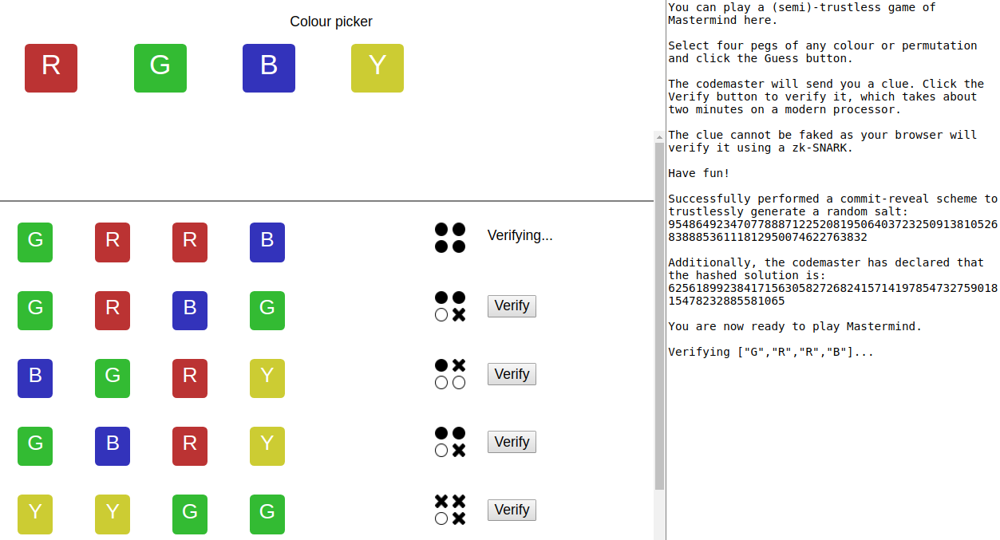
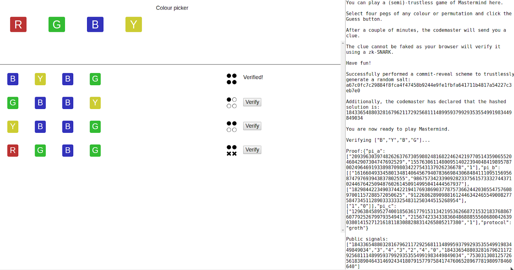
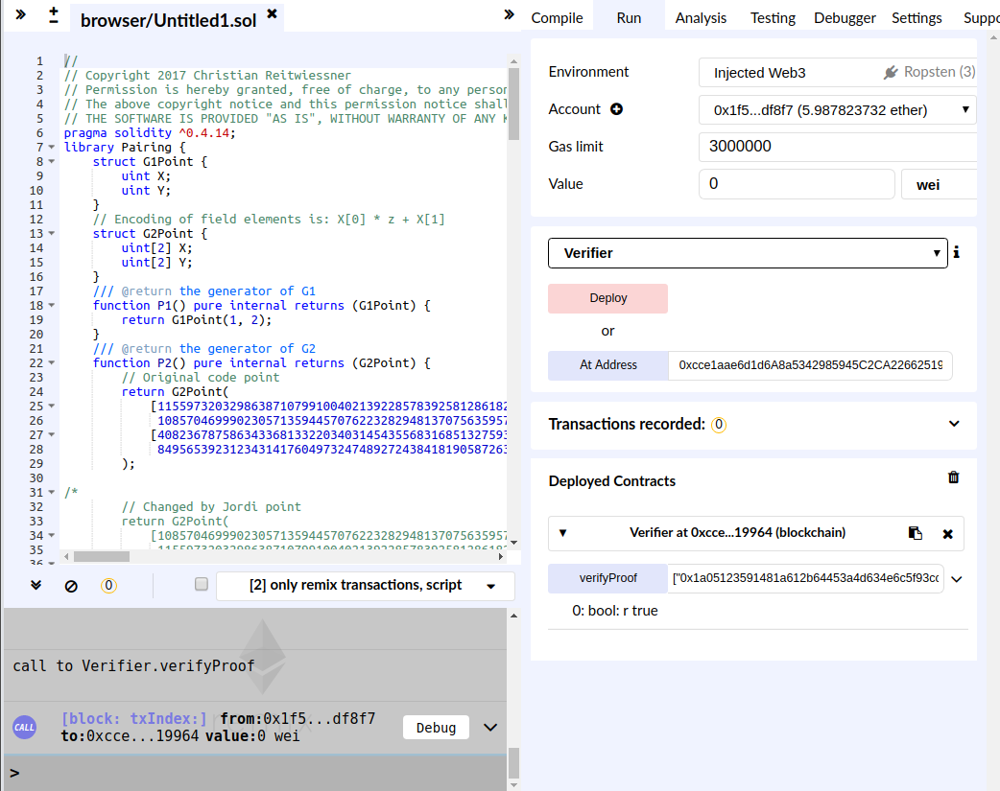

# A Mastermind game with zk-SNARKs

This is an implementation of the [Mastermind board
game](https://en.wikipedia.org/wiki/Mastermind_(board_game)) which uses
zk-SNARKs instead of a trusted third party to enforce game rules.

It uses the [`snarkjs`](https://github.com/iden3/snarkjs) and
[`circom`](https://github.com/iden3/circom) JavaScript libraries from
[iden3](https://iden3.io/).


[*Image source*](https://commons.wikimedia.org/wiki/File:Mastermind.jpg)


## About zk-SNARKS

zk-SNARKs allow you to cryptographically prove knowledge of some secret data
without revealing said data. For a simple explanation of zk-SNARKs, read [this
blog
post](https://media.consensys.net/introduction-to-zksnarks-with-examples-3283b554fc3b)
by Christian Lundkvist.

## The rules of Mastermind

There are two players: the *codebreaker* and the *codemaster*.

The codemaster creates a secret four-digit sequence of coloured pegs, limited
to red, blue, green, and yellow.

To win, the codebreaker must guess the secret sequence of pegs within a set
number of attempts. After each guess, if the codebreaker does not yet have the
correct solution, the codemaster must tell the codebreaker the following clue:

1) How many exact matches of colour and position there are — these are are
*black pegs*

2) How many pegs have matching colours, but are in the wrong position — these
are *white pegs*.

For example, if the solution is `R R B Y`, and the guess is `Y R B G`, the
codemaster must provide this clue: 2 black pegs and 1 white peg.

```
Solution       : Y R B G
Guess          : R R B Y

Exact matches  : 0 1 1 0 -> 2 black pegs
Inexact matches: 0 0 0 1 -> 1 white peg
```

Inexact matches do not overlap; for instance:

```
Solution       : R R Y B
Guess          : G G R B

Exact matches  : 0 0 0 1 -> 1 black peg
Inexact matches: 0 0 1 0 -> 1 white peg (not two, even though there are two red 
                                         pegs in the solution)
```

An illustrated example:


[*Image source*](https://www.mathworks.com/matlabcentral/fileexchange/11798-mastermind)

## The protocol

### 1. Prepare the circuit

Create an arithmetic circuit `C` which is essentially this function:

```
C (pubGuess, pubClue, pubSolutionHash, privSolution):
    hash(privSolution) === pubSolutionHash
    genClue(pubGuess, privSolution) === pubClue
```

That is, given the secret sequence `privSolution`, the guess `pubGuess`, the
clue `pubClue`, and a cryptographic hash of the secret sequence, the circuit:

a) calculates the correct clue and the cryptographic hash of the secret
sequence, and 

b) declares two *constraints*: that the cryptographic hash is correct and that
the clue is correct.

In a later step, the codebreaker can cryptographically verify that (a) and/or
(b) does not hold; more on that later.

### 2. Trusted setup

Generate the proving key, verifiying key, and toxic waste. Discard the toxic
waste. Make the proving key and verifying key public. For simplicity, we assume
that whoever did so can be trusted.

### 3. Generate a random salt

Using a commit-reveal scheme, the codemaster and codebreaker should arrive at a
random salt. This is not part of the zk-SNARK, but helps to prevent a rainbow
attack on the solution by the codebreaker.

### 4. Start the game

Before each game, the codemaster should generate the following:

a) the secret solution to the puzzle — e.g. `G R Y B`

b) the SHA256 hash of the solution and the salt

The codemaster should then send the hash to the codebreaker.

### 5. Make a guess

For each turn, the codebreaker should send their guess to the codemaster, who
should then generate the following:

a) the clue which corresponds to the secret solution and the guess;

b) a proof that the clue is correct, which is the result of computing:

```
proof = Prover(provingKey, pubGuess, pubClue, pubSolutionHash, privSolution)
```

The codemaster must then send the clue and the proof back to the codemaster,
who can verify that the clue is valid by computing:

```
Verify(verifyingKey, pubGuess, pubClue, pubSolutionHash, proof)
```

### 6. Repeat

Perform step 5 until the codebreaker guesses the correct solution. Note that
this implementation of Mastermind lets you make as many guesses as you want,
and even after you reach the correct solution.

## Running the game

You need the TypeScript compiler `tsc` v2.7.2 or higher, and Node v10 or
higher.

You may use `yarn` or `npm` as your package manager, but the following
instructions will use `yarn`.

## Setting up the circuit

### 1. Install dependencies

```
cd mastermind && \
yarn install && \
tsc
```

### 2. Compile the circuit

```
node build/mastermind/src/compile.js \
  -i mastermind/circuits/mastermind.circom \
  -o mastermind/circuits/mastermind.json -r
```

### 3. Perform the trusted setup

This takes about 30 seconds if you use Node 10 or greater. Note that it will
take about ten times longer to complete if you use Node 9, as Node 10 has more
optimised `BigInt` support.

```
mkdir -p mastermind/setup && \
node build/mastermind/src/trustedsetup.js \
  -i mastermind/circuits/mastermind.json \
  -pk mastermind/setup/mastermind.pk.json \
  -vk mastermind/setup/mastermind.vk.json -r
```

### 5. Generate a sample proof and public signals in JS

Generate the proof and public signals for a sample input:

```
mkdir -p mastermind/proofs mastermind/signals && \
node build/mastermind/src/generateproof.js \
  -c mastermind/circuits/mastermind.json \
  -vk mastermind/setup/mastermind.vk.json \
  -pk mastermind/setup/mastermind.pk.json \
  -po mastermind/proofs/mastermind.proof.json \
  -so mastermind/signals/testsignals.json
```

### 6. Verify a sample proof in JS

To verify it, run:

```
node build/mastermind/src/test_js_verification.js \
  -c mastermind/circuits/mastermind.json \
  -vk mastermind/setup/mastermind.vk.json \
  -p mastermind/proofs/mastermind.proof.json \
  -s mastermind/signals/testsignals.json
```

## Run the Mastermind game in your browser
First, build the frontend 

```
cd frontend && \
yarn install && \
yarn build:prod
```

You may also run the frontend development server using `yarn dev`.

In a different terminal, set up `virtualenv`:

```
cd backend && \
virtualenv -p python3 venv && \
source venv/bin/activate && \
pip3 install -r requirements.txt
```

Next, run the backend server in a separate terminal. Note that you have to
set the `NODE_PATH` environment variable to a Node binary of version 10 or
above.

```
NODE_PATH='/path/to/node/10+' 
```

```
cd zkmm/backend && \
source venv/bin/activate && \
python3 manage.py migrate && \
python3 manage.py collectstatic -c --noinput && \
python3 manage.py runserver
```

Launch [http://localhost:9000](http://localhost:9000) for the development
frontend environment, or [http://localhost:8000](http://localhost:8000) for the
production frontend environment.

Make a guess and click on the Verify button to have the backend generate a
proof, so that the frontend can verify the clue in the browser:



The proof takes about 18 seconds generate on an Intel i5 processor, and about 1
second to verify in the browser.



### Bonus: verify a sample proof in Solidity

Generate the Solidity code of the verifier, and deploy it to a Ethereum
network, like Ropsten.

If you wish to deploy it yourself, you can use
[Remix](http://remix.ethereum.org). Avoid using the Javascript VM to execute
the `verifyProof` function as your browser may freeze up. Instead, get some
Ropsten ether, deploy your contract to the testnet, and use that to verify the
proof.

Alternatively, you can connect to a working verifier contract on Ropsten
[here](https://ropsten.etherscan.io/address/0x4c7c0d2d8e74e3ba62b4a94e97d7d639c98837ea).


```
mkdir -p mastermind/contracts && \
node build/mastermind/src/generateverifier.js \
  -i mastermind/setup/mastermind.vk.json \
  -o mastermind/contracts/mastermindverifier.sol -r

```

Next, generate the contract call parameters and paste the output into Remix:

```
node build/mastermind/src/generatecall.js \
  -p mastermind/proofs/mastermind.proof.json \
  -s mastermind/signals/testsignals.json
```

Example output:

```
["0x204fbb7755e152c2368ad1df3bb8f5cfa95f39adc6222f42ab138e70b92850af", "0x01aef8e7b8a5c1205abf51c7c91bef1eaba5b1046c61d761c7a03d316dc0185d"],[["0x24c698c2dd423d7df4455dee12783e51ecd281cb82139c9439311b015af50189", "0x19e0cac361ebd59dbf365492e823c7c02022774a9882282e00b5df912d291a02"],["0x023219cbe60a4d8bac7068e92a05486ec877608c4eb7897273863bf32c2ad2cf", "0x022ed9097142b1009e021cef3afd7778eec3a0aa65f74cdd21830283c44ada2c"]],["0x2dc657c7ee0f4c325dfb24562733d355d9bb4d01010967544467fe44eef8e8f9", "0x2d5b9b3bcefa2e0d31de45202a29355ef70994ec911d443cf804823a4dd09177"],["0x16425edee78f5b01f5e18b132ce10936bd2e08d222c6f298ed121d498689915b","0x0000000000000000000000000000000000000000000000000000000000000001","0x0000000000000000000000000000000000000000000000000000000000000002","0x0000000000000000000000000000000000000000000000000000000000000002","0x0000000000000000000000000000000000000000000000000000000000000001","0x0000000000000000000000000000000000000000000000000000000000000001","0x0000000000000000000000000000000000000000000000000000000000000002","0x16425edee78f5b01f5e18b132ce10936bd2e08d222c6f298ed121d498689915b"]
```

Click the `verifyProof` button to execute the function.


